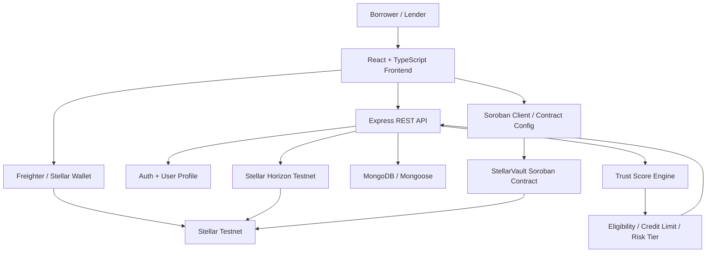
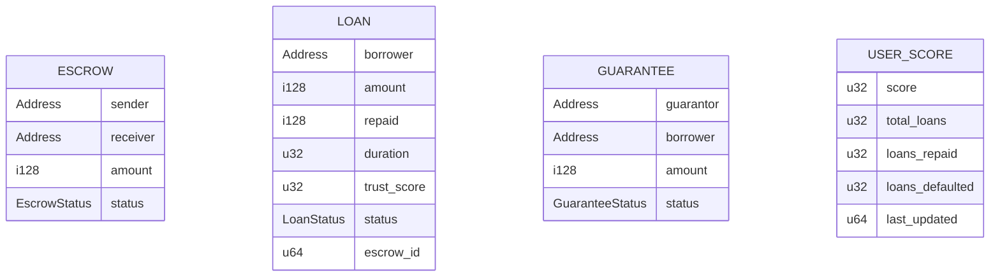
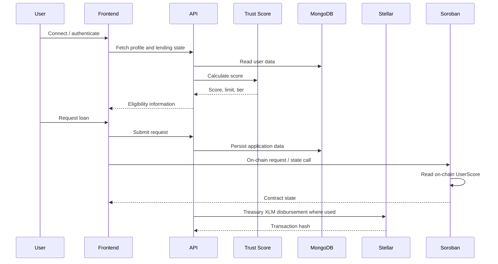
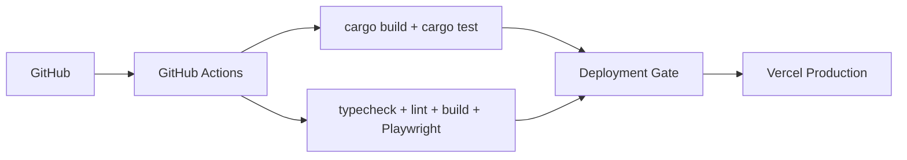

# 🏛 StellarVault System Architecture

## 1. Overview

StellarVault is an AI-assisted, reputation-based lending application built around a React frontend, an Express/MongoDB backend, Stellar wallet interactions, Horizon Testnet operations, and a Soroban smart contract.

### Runtime layers

- **Frontend:** React 18 + TypeScript + Vite
- **Backend:** Node.js + Express + TypeScript + MongoDB/Mongoose
- **Blockchain:** Stellar Testnet + Stellar SDK + Soroban/Rust
- **Risk layer:** deterministic 0–1000 Trust Score engine
- **Testing:** Playwright E2E + Rust contract tests

## 2. High-Level Architecture



## 3. Frontend Architecture

The frontend lives in `Frontend/`.

The active npm scripts use Vite:

```json
"dev": "vite",
"build": "tsc && vite build",
"preview": "vite preview",
"test:e2e": "playwright test"
```

Although `next` remains installed and an older generated README refers to Next.js, the current build pipeline is Vite-based.

### Main application areas

`Frontend/app/` contains:

- `admin/`
- `analytics/`
- `auth/`
- `borrow/`
- `dashboard/`
- `kyc/`
- `lend/`
- `social/`

### Frontend responsibilities

- Render borrower/lender workflows
- Connect to Stellar wallet APIs
- Display Trust Score and profile information
- Call the backend API
- Display lending, KYC, analytics, and social data
- Surface transaction state and errors

## 4. Backend Architecture

The backend lives in `server/` and uses Express, TypeScript, Mongoose, JWT, bcrypt, and Stellar SDK.

Mounted routes:

```text
/api/auth  -> server/routes/auth.ts
/api       -> server/routes.ts
/health    -> health check
```

### Models

- User
- Loan
- ActiveLoan
- Transaction
- LendPosition
- Endorsement
- Guarantor

### Backend domains

- Authentication
- User/profile/KYC
- Trust Score
- Loans and repayments
- Lending positions
- Transactions
- Endorsements and guarantors
- Admin statistics/fraud alerts

## 5. Trust Score Architecture

`server/utils/trustScore.ts` computes five weighted components:

| Component | Maximum |
| --- | ---: |
| On-chain / wallet behavior | 400 |
| Financial behavior | 250 |
| Social trust | 150 |
| KYC | 100 |
| Risk component | 100 |
| **Total** | **1000** |

The current implementation is deterministic/rule-based rather than a trained ML inference pipeline.

## 6. Blockchain Architecture

`server/stellar.ts` uses Horizon Testnet and `StellarSdk.Networks.TESTNET` for backend Stellar operations.

The Soroban contract source is:

```text
contracts/src/lib.rs
```

Current documented Testnet contract:

```text
CCM5NDCXGRACZBPKRXAPEOAJV4AO4ILAUN52TJBS7WTI4UL4RKWKUGKI
```

Explorer: https://stellar.expert/explorer/testnet/contract/CCM5NDCXGRACZBPKRXAPEOAJV4AO4ILAUN52TJBS7WTI4UL4RKWKUGKI

The contract stores:

- Admin
- Pool balance
- Escrows
- Loans
- Guarantees
- Wallet indexes
- User scores

## 7. Contract Data Model



## 8. Lending Flow



## 9. Important Architectural Constraint

StellarVault currently has two Trust Score representations.

### Backend

- Signup default: `500`
- Weighted score from MongoDB profile data
- Used by backend eligibility/disbursement logic

### Soroban

- `init_score` starts at `300`
- `request_loan` reads on-chain score
- `auto_release` currently approves at `>= 500`

No automatic synchronization between these stores is visible in the current repository.

### Before Mainnet

- Define one canonical score source
- Add authenticated score synchronization/attestation
- Add timestamps and model/rule versioning
- Add idempotency/replay protection
- Record decision provenance

## 10. Deployment Architecture



## 11. Source-of-Truth Files

| Area | Source |
| --- | --- |
| Frontend scripts/dependencies | `Frontend/package.json` |
| Frontend pages | `Frontend/app/` |
| E2E config | `Frontend/playwright.config.ts` |
| Backend entry | `server/server.ts` |
| API routes | `server/routes.ts` |
| Authentication | `server/routes/auth.ts` |
| Trust Score | `server/utils/trustScore.ts` |
| Stellar helper | `server/stellar.ts` |
| Soroban contract | `contracts/src/lib.rs` |
| CI/CD | `.github/workflows/deploy.yml` |
