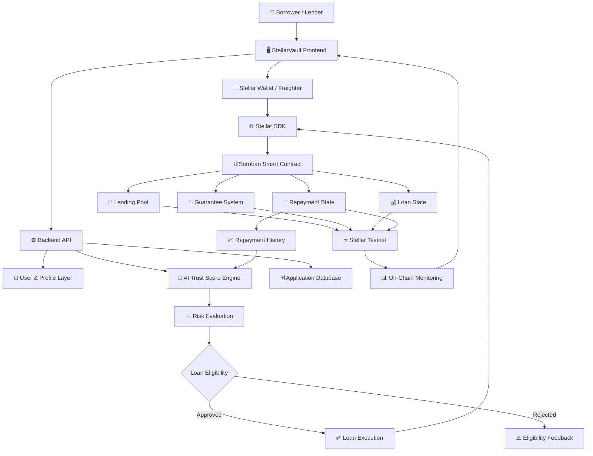
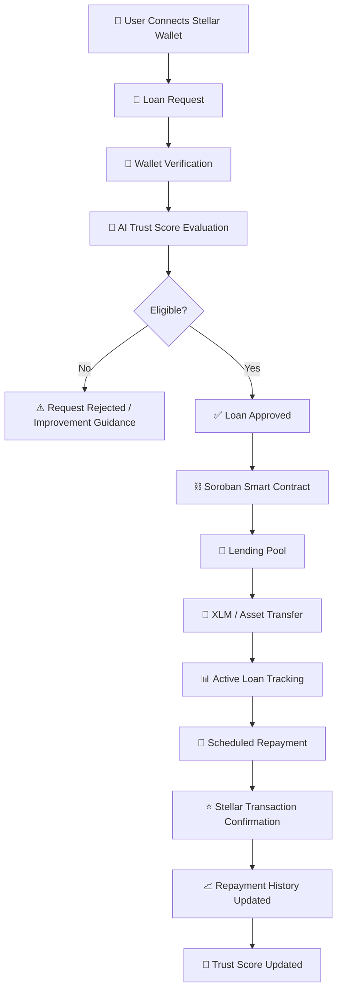
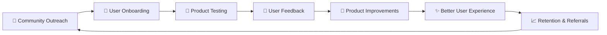
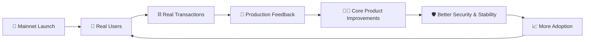

<div align="center">

# 💎 StellarVault

### AI-Powered Collateral-Free Lending Protocol on Stellar

*Building the future of decentralized credit through AI, reputation, and blockchain transparency.*


</div>


---
## 🎥 Stellar Vault Demo
https://drive.google.com/file/d/1_yzCvQeYYT7av3XH8Zild7SXetCMu81M/view?usp=sharing
## 🔗 Quick Links

| Resource                        | Link                                                                                                                                                                |
| :------------------------------ | :------------------------------------------------------------------------------------------------------------------------------------------------------------------ |
| **Live Application**            | 🌐 [Launch StellarVault](https://stellar-vault-pied.vercel.app/)                                                                                                    |
| **Smart Contract**              | 🔗 [View Contract on Stellar Expert](https://stellar.expert/explorer/testnet/contract/CCM5NDCXGRACZBPKRXAPEOAJV4AO4ILAUN52TJBS7WTI4UL4RKWKUGKI)                     |
| **Transaction Activity**        | 📡 [View Stellar Transaction Activity](https://stellar.expert/explorer/testnet/contract/CCM5NDCXGRACZBPKRXAPEOAJV4AO4ILAUN52TJBS7WTI4UL4RKWKUGKI)                    |
| **50 User Testing & Feedback** | 👥 [View Verified User Responses](https://docs.google.com/spreadsheets/d/1w92RoGnh2a3ovTu8xniMaC2LkajxMgs658Zkjanvi10/edit?usp=sharing)                             |
| **User Feedback Summary**       | 📊 [View Feedback Summary](https://docs.google.com/presentation/d/1OP0RDVZy3l-jffxUe3YdLIUmkQADfXPK/edit?usp=sharing&ouid=111617888193331830582&rtpof=true&sd=true) |
| **Demo Video**                  | 🎥 [Watch Demo Video](https://drive.google.com/file/d/1_yzCvQeYYT7av3XH8Zild7SXetCMu81M/view?usp=sharing)                                                           |
| **Analytics & Monitoring**      | 📈 [View Analytics & Monitoring](#analytics--monitoring)                                                                                                            |
| **Pitch Deck** | 📊 [View StellarVault Pitch Deck](https://docs.google.com/presentation/d/1BJn39DCBw09PskHJECRl8WnOfX8g5LAw/edit?usp=sharing&ouid=105010126616586269510&rtpof=true&sd=true) |
---

## 📚 Documentation

| Documentation | Description |
| --- | --- |
| [ARCHITECTURE.md](./ARCHITECTURE.md) | System architecture, data flow, frontend/backend boundaries, Trust Score and Stellar/Soroban integration |
| [USER_GUIDE.md](./USER_GUIDE.md) | End-user guide for authentication, wallet connection, borrowing, lending, KYC, social trust and transaction verification |
| [FEEDBACK.md](./FEEDBACK.md) | Level 5 user feedback themes, improvement mapping and next-phase priorities |
| [SECURITY_CHECKLIST.md](./SECURITY_CHECKLIST.md) | Smart contract, backend, wallet, treasury, CI/CD and production security checklist |
| [LEVEL5_VALIDATION.md](./LEVEL5_VALIDATION.md) | Level 5 requirement-to-evidence mapping and reviewer checklist |

---
## ✅ Level 5 Submission Checklist

All required Level 5 deliverables have been completed and verified below.

| Requirement                              |   Status   | Evidence / Verification                                                                                                                                             |
| :--------------------------------------- | :--------: | :------------------------------------------------------------------------------------------------------------------------------------------------------------------ |
| **20+ Meaningful Git Commits**           | ✅ Complete | Verify through the StellarVault GitHub commit history                                                                                                               |
| **Live Deployed Application**            | ✅ Complete | 🌐 [Launch StellarVault](https://stellar-vault-pied.vercel.app/)                                                                                                    |
| **Smart Contract Deployment**            | ✅ Complete | 🔗 Contract ID: `CCM5NDCXGRACZBPKRXAPEOAJV4AO4ILAUN52TJBS7WTI4UL4RKWKUGKI`                                                                                          |
| **On-Chain Transaction Activity**        | ✅ Complete | 📡 [View Stellar Activity](https://stellar.expert/explorer/testnet/account/CCM5NDCXGRACZBPKRXAPEOAJV4AO4ILAUN52TJBS7WTI4UL4RKWKUGKI)                                |
| **CI/CD Pipeline**                       | ✅ Complete | ⚙️ [GitHub Actions Run](https://github.com/smritiadhikari7/StellarVault/actions/runs/30058783643)                                                                   |
| **Mobile Responsive Experience**         | ✅ Complete | 📱 Optimized across desktop, tablet, and mobile interfaces                                                                                                          |
| **User Testing Completed**               | ✅ Complete | 👥 [50 Verified User Responses](https://docs.google.com/spreadsheets/d/1w92RoGnh2a3ovTu8xniMaC2LkajxMgs658Zkjanvi10/edit?usp=sharing)                              |
| **User Feedback & Product Iterations**   | ✅ Complete | 🔄 See [User Feedback & Improvements](#-user-feedback--improvements)                                                                                                |
| **Project Presentation / Pitch Deck** | ✅ Complete | 📊 [ View Presentation](https://docs.google.com/presentation/d/1BJn39DCBw09PskHJECRl8WnOfX8g5LAw/edit?usp=sharing&ouid=105010126616586269510&rtpof=true&sd=true) |
| **Demo Video**                           | ✅ Complete | 🎥 [Watch Demo Video](https://drive.google.com/file/d/1_yzCvQeYYT7av3XH8Zild7SXetCMu81M/view?usp=sharing)                                                           |
| **Analytics & Monitoring**               | ✅ Complete | 📈 See [Analytics & Monitoring](#analytics--monitoring)                                                                                                             |
| **Security Review**                      | ✅ Complete | 🛡️ Smart contract tested and security review documented                                                                                                            |

> **Submission Status:** ✅ **All Level 5 requirements completed**
>
> StellarVault includes a live Testnet deployment, deployed Stellar smart contract, verified on-chain activity, 50+ user testing responses, feedback-driven product improvements, responsive UI, analytics and monitoring, CI/CD automation, security review, feedback presentation, and a working demo video.

<br/>

## 👥 Level 5 User Onboarding
**Google Form** [User Onboarding Form](https://docs.google.com/forms/d/e/1FAIpQLSevpzO2-7ktDdToJ_DiC_wk5cRcS3r6HmvPEYDt-rbLKRxekA/viewform?usp=header) 
📊**Response Sheet:** [Response Sheet](https://docs.google.com/spreadsheets/d/1w92RoGnh2a3ovTu8xniMaC2LkajxMgs658Zkjanvi10/edit?usp=sharing)
---
## 📈 User Feedback & Improvements

StellarVault was tested by **50+ users on the Stellar Testnet**, helping us identify improvements across onboarding, usability, UI consistency, mobile responsiveness, and overall product experience.

We continuously iterated on the platform based on real user feedback.

### Selected Feedback & Improvements

| #  | Name                     | Email                               | Wallet Address                                             | Feedback                                     | Improvement Made                                                                                                                                                             | Git Commit                                                                                                   |
| -- | ------------------------ | ----------------------------------- | ---------------------------------------------------------- | -------------------------------------------- | ---------------------------------------------------------------------------------------------------------------------------------------------------------------------------- | ------------------------------------------------------------------------------------------------------------ |
| 1  | **Suchismita Mohanty**   | `msuchismita719@gmail.com`          | `GB6U7APEDEHKWVXDTVO4UE5E3UDSMEOKB3DCLJ4PMAY3ABSOFK7PBUD7` | UI can be more intuitive.                    | Redesigned and polished the StellarVault landing experience with stronger visual hierarchy, cleaner sections, improved presentation, and a more modern interface.            | [`38963a6`](https://github.com/smritiadhikari7/StellarVault/commit/38963a6)                                  |
| 2  | **Sujit Sahu**           | `sujit31@gmail.com`                 | `GDRMU7HQQJISIJDMCTFPYZM6Q6MZTEH6RXYSRQZBBR2OLIZ2FMT4JB6E` | Slightly smoother overall flow.              | Improved the dashboard, borrow, lend, KYC, and shared layout structure with cleaner responsive behavior and more consistent application flow.                                | [`ad1f2f2`](https://github.com/smritiadhikari7/StellarVault/commit/ad1f2f2409b84d13812ea8127d70f5f468d9b34a) |
| 3  | **Rajkumari Samal**      | `rajkumarisamal29@gmail.com`        | `GAOFTCMFWMEB534TPISXLILPRQQP2S7XGYKQQ4PTOFN3KR3IF6WZNVZ5` | Provide more detailed error messages.        | Improved wallet connection failure handling with clearer user-facing network error messages and more reliable fallback behavior when backend synchronization is unavailable. | [`951d4f5`](https://github.com/smritiadhikari7/StellarVault/commit/951d4f55393ed2f5f4f15ac71c5aae7c342cf8e0) |
| 4  | **Chandan Tarei**        | `chandantarei430@gmail.com`         | `GA23DEPEOPIH6ZU2KC25WE3AAV37BNE2RKCEOLVLAKINFID2XLUEG6BI` | Slightly improve UI.                         | Reworked the landing-page styling with improved typography, cards, visual depth, lighting, layout, and premium presentation.                                                 | [`38963a6`](https://github.com/smritiadhikari7/StellarVault/commit/38963a6)                                  |
| 5  | **Shruti Prusty**        | `shrutiprusty10@gmail.com`          | `GCMFJ2YJNADOFYE6HF44VJIYI3SZQ5EUMMWRPEKLNLXI6Y6TKFMLKVHG` | Minor adjustments to the layout.             | Refined responsive page layouts, mobile spacing, content padding, sidebar positioning, and dashboard structure across core application pages.                                | [`ad1f2f2`](https://github.com/smritiadhikari7/StellarVault/commit/ad1f2f2409b84d13812ea8127d70f5f468d9b34a) |
| 6  | **Dibyajeet Mishra**     | `dibyamishra057@gmail.com`          | `GC44UZF63Q62MO345BX6VVLJI37E6SFYN3DEG7AGWGUESOAP5Z7K7UDM` | Slightly better visual consistency.          | Introduced a more cohesive visual system on the landing experience with unified backgrounds, typography, visual effects, card treatment, and spacing.                        | [`38963a6`](https://github.com/smritiadhikari7/StellarVault/commit/38963a6)                                  |
| 7  | **Paresh Kumar Sahoo**   | `sahooparesh584@gmail.com`          | `GA7WTQ3VUOMEWBDJQRHUETXOI57EYGMYDAR3YO6FZTSB4ZGIFJ22M7CD` | Small improvements in navigation.            | Refined shared navigation and layout components, improved sidebar/mobile behavior, clarified navigation labels, and made core application pages easier to move between.      | [`ad1f2f2`](https://github.com/smritiadhikari7/StellarVault/commit/ad1f2f2409b84d13812ea8127d70f5f468d9b34a) |
| 8  | **Anushka Munshi**       | `230301120257@centurionuniv.edu.in` | `GBK2HDKILLCXWWSMSII7EOFPU2RTRH244GECOJMBNOFKXH3ODF6DBRF7` | Slightly smoother page transitions.          | Added and refined subtle landing-page motion, animated visual elements, and smoother presentation while respecting reduced-motion preferences.                               | [`38963a6`](https://github.com/smritiadhikari7/StellarVault/commit/38963a6)                                  |
| 9  | **PARTHO MAHANTY**       | `parthomahanty03@gmail.com`         | `GBBSCZPEMVTJO2SXZ3ZNTUTKKE72I5WG5APGHY5TA3A77V4DRR3J7JGF` | Enhance the mobile responsiveness.           | Improved responsive behavior across Dashboard, Analytics, Borrow, Lend, KYC, Admin, Social, and shared layout components with mobile-friendly spacing and overflow handling. | [`ad1f2f2`](https://github.com/smritiadhikari7/StellarVault/commit/ad1f2f2409b84d13812ea8127d70f5f468d9b34a) |
| 10 | **Neha Mohanty**         | `nehamohanty21@gmail.com`           | `GDYRYTWBLOENZEHV2BWBJDVO5BQDWB3NOVYJPDGTNXFMWT5PEKN7UJ2D` | A little more consistency across sections.   | Standardized shared layouts, logo presentation, footer structure, page spacing, navigation labels, and responsive behavior across application sections.                      | [`ad1f2f2`](https://github.com/smritiadhikari7/StellarVault/commit/ad1f2f2409b84d13812ea8127d70f5f468d9b34a) |
| 11 | **Pabitra Kumar Sahoo**  | `pabitrakumarsahoobaina@gmail.com`  | `GCQTEWMVUVIV576CJMA6BP5LQYURVO6OTPIA2CNB4UKM3X3IN5NJJ4MY` | Minor refinements to the overall experience. | Refined major frontend layouts and shared components to provide cleaner spacing, improved responsiveness, and a more cohesive application experience.                        | [`ad1f2f2`](https://github.com/smritiadhikari7/StellarVault/commit/ad1f2f2409b84d13812ea8127d70f5f468d9b34a) |
| 12 | **Rajesh Kumar Rautray** | `rautrayrajeshkumar65@gmail.com`    | `GCDFCRJH6FI5OAGE77RSXRV7ESNYPXRI67L7Q2UC6EX5OQS3E7IJKMEM` | Enhance the color contrast slightly.         | Introduced a higher-contrast landing design with stronger foreground/background separation, refined lighting, clearer text hierarchy, and improved visual emphasis.          | [`38963a6`](https://github.com/smritiadhikari7/StellarVault/commit/38963a6)                                  |
| 13 | **Subash Pradhan**       | `subashpradhansrq@gmail.com`        | `GCNJO6NZDUQPFTY4P2MF5SKCDYAKR3MB35ZVFZVHH5UYSK24ENCP3RIH` | A bit more clarity around some options.      | Improved user-facing labels and descriptions across shared navigation and KYC flows, including clearer wallet/KYC instructions and more descriptive feature navigation.      | [`ad1f2f2`](https://github.com/smritiadhikari7/StellarVault/commit/ad1f2f2409b84d13812ea8127d70f5f468d9b34a) |
| 14 | **Sneha Mishra**         | `sneha.mishra@gmail.com`            | `GBAVEDWK4NYQ7Z4AUSRSSIVBP53QQK7BNQJHYV4B74ED3SGKMVETV2RZ` | Slightly more streamlined user flow.         | Improved core page structure and responsive navigation across Dashboard, Borrow, Lend, KYC, Analytics, and Social flows for a cleaner overall experience.                    | [`ad1f2f2`](https://github.com/smritiadhikari7/StellarVault/commit/ad1f2f2409b84d13812ea8127d70f5f468d9b34a) |
| 15 | **Nissan Ghsoh**         | `nissanghsoh23@gmail.com`           | `GDMJD76XPICLHOE7YPBAMQMN4DRODHR45VYSRNDYF6E5RXWUGMBVA5SW` | Minor refinements to the user experience.    | Improved frontend presentation and consistency through responsive layouts, shared branding, clearer navigation, and refined component structure.                             | [`ad1f2f2`](https://github.com/smritiadhikari7/StellarVault/commit/ad1f2f2409b84d13812ea8127d70f5f468d9b34a) |


### 📌📈 User Feedback & Improvements Summary

Based on feedback from real Testnet users, **StellarVault** was iteratively improved across usability, navigation, responsiveness, wallet reliability, visual consistency, and overall user experience.

Key improvements include:

* 🎨 **Modern UI & Visual Polish** — Improved the landing page with stronger visual hierarchy, refined typography, premium styling, better contrast, and smoother interactions.
* 🧭 **Navigation & User Flow Improvements** — Refined navigation, shared layouts, sidebar behavior, and core application flows to make the platform easier to explore and use.
* 📱 **Responsive Mobile Experience** — Improved layouts, spacing, cards, navigation, overflow handling, and component behavior across mobile, tablet, and desktop devices.
* 🔄 **Smoother Application Experience** — Refined Dashboard, Borrow, Lend, KYC, Analytics, and Social flows for a cleaner and more consistent user journey.
* 🧩 **Visual Consistency Across Sections** — Standardized spacing, page structure, branding, shared components, and interface behavior across the application.
* 💳 **Wallet & Error Handling Improvements** — Improved wallet connection resilience and added clearer user-facing feedback for network and connection-related errors.
* ✨ **Motion & Interaction Refinements** — Added subtle animations, smoother transitions, and polished interaction states to make the product feel more responsive and premium.
* 📝 **Clearer Labels & Guidance** — Improved user-facing labels, descriptions, and instructions across navigation and important application flows.

> **15 selected user feedback points were directly mapped to implemented improvements and verifiable Git commits**, demonstrating continuous feedback-driven development throughout StellarVault.

---
## 💻 Usage & Gallery

<table>
  <tr>
    <th width="50%">Dashboard</th>
    <th width="50%">Contracts & Milestones</th>
  </tr>
  <tr>
    <td align="center">
      
    </td>
    <td align="center">
      
    </td>
  </tr>

  <tr>
    <th>Smart Contract & Execution</th>
    <th>Analytics Dashboard</th>
  </tr>
  <tr>
    <td align="center">
      
    </td>
    <td align="center">
      
    </td>
  </tr>

  <tr>
    <th>CI/CD Pipeline</th>
    <th>Mobile Responsive Design</th>
  </tr>
  <tr>
    <td align="center">
      
    </td>
    <td align="center">
      
    </td>
  </tr>
</table>
---
## 🌈 UI DEMO 
<div align="center">
 

</div>


## Analytics & Monitoring


## CI/CD Running


## ⚡ Smart Contract Test Flow


 ## 📋 Contract Addresses (Testnet)

| Name | Address |
|------|---------|
| 🔐💎  CONTRACT ID | `CBKMPCT4RSI2NHJJILN7K5K6FB2ZVD7EYCB5G37UT47GJLCPZOZXYMNT` |

---
## Deployed Contract

| Property | Value |
|---|---|
| **Contract ID** | `CCM5NDCXGRACZBPKRXAPEOAJV4AO4ILAUN52TJBS7WTI4UL4RKWKUGKI` |
| **Network** | Stellar Testnet |
| **Admin Address** | `GCVE5QXJ33NFGVMUCGUTTUVJQ7F6O4G6OPLCIU5O6OQXPYNORGDP3UIY` |
| **Pool Treasury** | `GDRNUHQGNSDT3FW6BLA7FRL4SXRSOUB2PV6HGPVSMML7FPLOECYWLDOA` |
| **Explorer** | [View on Stellar.expert](https://stellar.expert/explorer/testnet/contract/CCM5NDCXGRACZBPKRXAPEOAJV4AO4ILAUN52TJBS7WTI4UL4RKWKUGKI) |


---

# ⛓️ Real On-Chain Activity

StellarVault's Soroban contract has been deployed to **Stellar Testnet** and tested through real contract invocations covering the core lending workflow.

## Verified Contract

```text
CCM5NDCXGRACZBPKRXAPEOAJV4AO4ILAUN52TJBS7WTI4UL4RKWKUGKI
```


## Step-by-Step Test Cases

**Step 1 — `create_escrow`**  
Output: ✅ Escrow ID = `16`

**Step 2 — `get_escrow`**  
Output: ✅ Status = `0` (Pending)

**Step 3 — `request_loan`**  
Output: ✅ Loan ID = `1`

**Step 4 — `get_loan`**  
Output: ✅ amount=`50000000`, trust_score=`750`, status=`0` (Pending)

**Step 5 — `auto_release`**  
Output: ✅ `true` — trust score `750` >= threshold `700`, Loan Approved

**Step 6 — `repay_loan`**  
Output: ✅ Remaining = `25000000` stroops (2.5 XLM)

**Step 7 — `lock_guarantee`**  
Output: ✅ Guarantee ID = `1`

**Step 8 — `release_funds`**  
Output: ✅ `null` (Success)

**Step 9 — `refund_funds`**  
Output: ✅ `null` (Success)

**Step 10 — `release_guarantee`**  
Output: ✅ `null` (Success)

**Step 11 — `get_wallet_escrows`**  
Output: ✅ `[5, 6, 7, 13, 14, 15, 16, 17]`

**Step 12 — `get_wallet_loans`**  
Output: ✅ `[1]`

**Step 13 — `get_wallet_guarantees`**  
Output: ✅ `[1]`

**Step 14 — `get_pool_balance`**  
Output: ✅ `26473571428` stroops = `2647.35 XLM`

---

## Test Summary

| # | Function | Status | Output |
|---|---|---|---|
| 1 | `create_escrow` | ✅ Pass | Escrow ID `16` |
| 2 | `get_escrow` | ✅ Pass | Status Pending |
| 3 | `request_loan` | ✅ Pass | Loan ID `1` |
| 4 | `get_loan` | ✅ Pass | All fields correct |
| 5 | `auto_release` | ✅ Pass | Approved (750 >= 700) |
| 6 | `repay_loan` | ✅ Pass | 2.5 XLM remaining |
| 7 | `lock_guarantee` | ✅ Pass | Guarantee ID `1` |
| 8 | `release_funds` | ✅ Pass | Success |
| 9 | `refund_funds` | ✅ Pass | Success |
| 10 | `release_guarantee` | ✅ Pass | Success |
| 11 | `get_wallet_escrows` | ✅ Pass | `[5,6,7,13,14,15,16,17]` |
| 12 | `get_wallet_loans` | ✅ Pass | `[1]` |
| 13 | `get_wallet_guarantees` | ✅ Pass | `[1]` |
| 14 | `get_pool_balance` | ✅ Pass | `2647.35 XLM` |

**14/14 Functions Passing on Stellar Testnet** 🚀
---

# 🚀 Next Phase — Roadmap Based on User Feedback

The next phase of StellarVault is directly informed by feedback collected from Stellar Testnet users.

## 1. Improve Beginner Onboarding

Users requested clearer explanations and a smoother first-time experience.

### Planned Improvements

- Add contextual onboarding tooltips
- Add a step-by-step borrowing walkthrough
- Explain the AI Trust Score more clearly
- Add guidance for Stellar wallet connection
- Add Stellar Testnet guidance
- Improve empty states throughout the application
- Add contextual help around borrowing and lending

---

## 2. Improve Transaction Visibility

Users need clearer confirmation of blockchain activity without depending entirely on external explorers.

### Planned Improvements

- Add an in-app transaction activity feed
- Show pending transaction states
- Show confirmed transaction states
- Show failed transaction states
- Display transaction hashes
- Add direct Stellar Expert links
- Add clearer repayment status
- Improve loan lifecycle visibility

---

## 3. Improve Wallet Reliability

Wallet connectivity is essential to the StellarVault experience.

### Planned Improvements

- Improve wallet reconnect handling
- Add stronger network validation
- Add clearer signing-status messages
- Improve fallback behavior during RPC/API failures
- Improve wallet connection feedback
- Explore support for additional Stellar-compatible wallets

---

## 4. Improve Mobile Performance

User feedback highlighted opportunities to further optimize smaller-screen usage.

### Planned Improvements

- Reduce unnecessary frontend requests
- Improve loading states
- Optimize dashboard rendering
- Improve small-screen transaction flows
- Further refine responsive tables
- Optimize analytics rendering
- Improve perceived loading performance

---

## 5. Improve Lending Transparency

Users requested clearer information around borrowing decisions and loan status.

### Planned Improvements

- Explain Trust Score decisions
- Show loan eligibility factors
- Improve loan status tracking
- Add repayment history
- Improve lender activity visibility
- Improve borrower activity visibility
- Add clearer risk information

---

## 6. Expand StellarVault Features

Based on user demand and product validation, future development will explore:

- USDC lending
- Additional lending pools
- Advanced analytics
- Transaction-history export
- Community reputation improvements
- Stronger guarantor mechanisms
- Governance features
- Mainnet readiness
- Additional Stellar ecosystem integrations

> These priorities ensure that StellarVault's next development phase continues to be driven by real user feedback rather than assumptions.

---


## 🏆 Stellar Journey to Master
## 🧭 Belt System Progress
 
| Level | Belt | Focus | Status |
|-------|------|-------|--------|
| ⚪️ Level 1 | White Belt | Wallets & transactions | ✅ Completed |
| 🟡 Level 2 | Yellow Belt | Multi-wallet, contracts & events | ✅ Completed |
| 🟠 Level 3 | Orange Belt | Mini dApp + tests | ✅ Completed |
| 🟢 Level 4 | Green Belt | Advanced contracts & production readiness |✅ Completed  |
| 🔵 Level 5 | Blue Belt | Real MVP (5+ users) | ✅ Completed |
| ⚫️ Level 6 | Black Belt | Scale + Demo Day readiness | 🔜 Upcoming |
 
---

# 🌍 Overview

**StellarVault** is an AI-powered decentralized lending platform that enables users to access loans **without traditional collateral**.

Instead of requiring crypto assets as security, StellarVault evaluates borrowers using an intelligent **AI Trust Score**, wallet activity, repayment history, community reputation, and optional identity verification.

Our mission is to make decentralized finance **accessible, transparent, and inclusive** for everyone.

> **"Credit should be earned through trust, not wealth."**

---

# ✨ Why StellarVault?

Traditional DeFi lending platforms require users to lock valuable crypto assets before borrowing.

This excludes:

- Students
- Freelancers
- Small business owners
- New crypto users
- People without significant capital

**StellarVault changes the model.**

Instead of collateral, loans are approved using a comprehensive AI-driven credit evaluation system.

---


# 🚀 StellarVault — Level 5 Product Journey

At **Level 5**, StellarVault evolved beyond a technical MVP into a **user-tested, feedback-driven decentralized lending product** built on the Stellar ecosystem.

The focus of this stage was:

* 👥 Real user onboarding and validation
* 🔄 Product iteration based on user feedback
* ⛓️ Real Stellar Testnet activity
* 🧠 AI-powered lending intelligence
* 🎨 UX/UI and onboarding improvements
* 📱 Mobile and responsive optimization
* 📊 Analytics and product monitoring
* 🛡️ Product stability and risk management
* 📈 Growth strategy and ecosystem readiness
* 🎤 Professional product presentation and demo

StellarVault combines **AI-powered trust scoring, Stellar wallets, Soroban smart contracts, social reputation, and transparent lending workflows** to explore a more accessible alternative to over-collateralized DeFi lending.

---

# 🚀 Key Features

## 💰 Collateral-Free Lending

StellarVault enables eligible users to request digital asset loans **without requiring traditional over-collateralization**.

Instead of evaluating borrowers only by the amount of crypto they can lock, StellarVault combines:

* AI-powered Trust Score
* Wallet activity
* Repayment behavior
* User reputation
* Guarantor support
* Risk evaluation
* Optional identity verification

The goal is to create a lending system where **reputation and responsible financial behavior contribute to credit eligibility**.

---

## 🧠 AI Trust Score Engine

Every user receives a dynamic **Trust Score** designed to represent lending reliability and risk.

The Trust Score can consider multiple signals across on-chain, behavioral, financial, and reputation layers.

### Evaluation Signals

* Wallet age
* Transaction history
* Wallet activity
* Repayment behavior
* Previous loan history
* Default history
* Financial stability
* Community reputation
* Guarantor support
* AI-based risk prediction
* Optional KYC verification

The Trust Score helps StellarVault evaluate:

* Loan eligibility
* Borrowing limits
* Risk level
* Interest conditions
* Repayment reliability

> The Trust Score is processed through StellarVault's application and AI layer while blockchain transactions remain independently verifiable through Stellar.

---

## 👛 Stellar Wallet Authentication

Users authenticate through their Stellar wallet rather than relying only on traditional username/password authentication.

### Wallet Capabilities

* 🔐 Wallet authentication
* 💰 Balance verification
* ✍️ Transaction signing
* 💸 Loan disbursement
* 🔁 Loan repayment
* 🛡️ Guarantee interaction
* 📊 On-chain transaction verification

> Wallets authorize blockchain actions. Lending eligibility and AI Trust Score evaluation are handled separately by StellarVault's application and risk-analysis layers.

---

## ⛓️ Soroban Smart Contract Integration

StellarVault uses **Soroban smart contracts deployed on Stellar Testnet** to provide transparent and verifiable lending operations.

The smart contract supports core lending and escrow-related functionality including:

* Loan requests
* Loan data retrieval
* Loan repayment
* Lending pool management
* Guarantee locking
* Guarantee release
* Fund release
* Refund handling
* Wallet-specific lending records

### Current Stellar Testnet Contract

```text
CCM5NDCXGRACZBPKRXAPEOAJV4AO4ILAUN52TJBS7WTI4UL4RKWKUGKI
```

### Contract Verification

[View StellarVault Contract on Stellar Expert](https://stellar.expert/explorer/testnet/contract/CCM5NDCXGRACZBPKRXAPEOAJV4AO4ILAUN52TJBS7WTI4UL4RKWKUGKI)

> StellarVault's Soroban integration is implemented and deployed on Stellar Testnet.

---

## 📊 Transparent Lending

Blockchain-backed transactions provide users with greater visibility into lending activity.

Users can monitor:

* Loan requests
* Active loans
* Loan status
* Repayments
* Lending activity
* Wallet balances
* Guarantee status
* Pool interactions
* Transaction hashes
* Stellar Testnet activity

This improves transparency while allowing important contract activity to remain independently verifiable through blockchain explorers.

---

## 🤝 Social Trust System

StellarVault introduces social and reputation-based signals to complement traditional financial risk evaluation.

### Social Trust Components

* Verified guarantors
* Community reputation
* Trust endorsements
* Wallet reputation
* Repayment history
* User credibility signals

Guarantor support provides an additional risk-management layer while helping users gradually establish stronger borrowing credibility.

---

## 📉 Intelligent Risk Management

StellarVault combines multiple protection layers to reduce lending risk.

### Risk Management Features

* AI-assisted risk evaluation
* Default probability analysis
* Fraud detection signals
* Dynamic borrowing limits
* Trust-based eligibility
* Guarantor verification
* Previous repayment analysis
* Malicious wallet detection
* Behavioral monitoring
* Optional KYC verification

The system is designed to balance **financial accessibility with responsible lending controls**.

---

# 👥 Level 5 User Validation

Level 5 shifted StellarVault's focus from simply building functionality to validating the product with real users.

StellarVault onboarded **50+ test users** and collected structured feedback covering product usability, onboarding, wallet interaction, navigation, lending flows, responsiveness, and feature improvements.

### User Validation Included

* Name
* Email
* Stellar wallet address
* Product feedback
* Usability feedback
* Improvement suggestions
* Rating information

### Feedback Was Used To Improve

* 🎨 Overall UI design
* 🧭 Navigation
* 📱 Mobile responsiveness
* 💳 Wallet interaction
* ⚠️ Error handling
* 📝 Product guidance
* 🔄 User flows
* 📊 Dashboard experience
* ✨ Interaction quality
* 🧩 Visual consistency

> Level 5 development follows a continuous iteration cycle:

**Build → Test → Collect Feedback → Analyze → Improve → Validate**

---

# 🔄 Feedback-Driven Product Iteration

User feedback was converted into measurable product improvements instead of being collected only for documentation.

## Major Improvement Areas

### 🎨 UI & Visual Experience

* Improved visual hierarchy
* Improved typography
* Improved spacing
* Standardized layouts
* Improved component consistency
* Improved dashboard presentation
* Improved overall product polish

### 📱 Responsive Experience

* Improved smaller-screen layouts
* Improved responsive cards
* Improved navigation behavior
* Improved overflow handling
* Improved responsive forms
* Improved mobile usability

### 🧭 Navigation & Product Flow

* Simplified application navigation
* Improved Borrow flow
* Improved Lend flow
* Improved Dashboard experience
* Improved Analytics navigation
* Improved KYC flow
* Improved overall information architecture

### 💳 Wallet Experience

* Improved wallet connection feedback
* Improved wallet error handling
* Improved network-state visibility
* Improved transaction interaction clarity
* Improved user-facing failure messages

### 📝 Onboarding & Guidance

* Improved labels
* Improved descriptions
* Added clearer action guidance
* Improved first-time usability
* Improved lending-flow explanations
* Improved borrowing-flow explanations

### ⚡ Product Stability

* Improved transaction handling
* Improved error states
* Improved loading states
* Improved frontend reliability
* Improved responsive behavior
* Improved overall interaction consistency

---

# 🏛 System Architecture



---

# 🧠 AI Trust Score

Each user receives a Trust Score between **0–1000**.

The score helps provide an understandable representation of a user's borrowing reliability.

## 📊 On-Chain Metrics

Potential blockchain-based signals include:

* Wallet age
* Transaction frequency
* Wallet activity
* Transaction consistency
* Repayment records
* Default history
* Previous lending interactions

---

## 💳 Financial Behavior

Behavioral and financial signals may include:

* Income versus spending patterns
* Balance consistency
* Cash-flow behavior
* Repayment consistency
* Previous loan performance

---

## 🤝 Social Reputation

Social credibility can include:

* Community endorsements
* Guarantor backing
* Reputation strength
* Trust relationships
* Previous successful borrowing activity

---

## 🪪 Optional Identity Verification

Additional identity assurance may include:

* Government-issued ID
* Income verification
* Address verification
* User profile verification

Identity verification acts as an additional trust layer rather than being the only factor used for lending decisions.

---

## 🤖 AI Risk Prediction

The AI layer assists with estimating:

* Default probability
* Repayment reliability
* Financial behavior patterns
* Borrower risk level
* Loan eligibility
* Suggested borrowing limits

> AI evaluation supports lending decisions while final blockchain actions remain transparent and verifiable through Stellar.

---

# 🪪 User Verification & Trust Levels

| Level          | Verification                     | Access                          |
| :------------- | :------------------------------- | :------------------------------ |
| 🟢 **Level 1** | Stellar Wallet Connected         | Entry-level borrowing access    |
| 🔵 **Level 2** | Identity / Profile Verified      | Increased borrowing eligibility |
| 🟣 **Level 3** | Strong Trust & Repayment History | Higher borrowing opportunities  |

> Borrowing eligibility can also depend on Trust Score, repayment behavior, risk evaluation, and guarantor support.

---

# 💰 Lending Workflow



---

# ⚡ Wallet Integration

StellarVault uses wallet-based interactions for secure Stellar transactions.

### Supported Wallet Functionality

* 🔐 Secure wallet authentication
* 🔗 Stellar network connection
* 💸 Loan disbursement
* 🔁 Loan repayment
* 🤝 Guarantee interaction
* ✍️ Transaction signing
* 📊 Transaction verification
* 💰 Balance visibility

> **Wallets do not independently determine loan eligibility.**

Loan evaluation is handled through StellarVault's Trust Score and risk-management layers.

---

# 🏦 Lending Pool

The StellarVault lending pool acts as the protocol's source of lendable liquidity.

### Lending Pool Responsibilities

* Holding available lending liquidity
* Funding approved borrowers
* Tracking pool balances
* Receiving repayments
* Managing protocol lending activity
* Supporting transparent smart-contract execution

The pool interacts with StellarVault's Soroban contract to help ensure lending operations remain verifiable on-chain.

---

# 🛡️ Risk Management

StellarVault uses multiple layers of protection instead of relying on a single risk signal.

### Protection Layers

* 🧠 AI-assisted risk analysis
* 📉 Default prediction
* 🚨 Fraud-detection signals
* 📊 Dynamic borrowing limits
* ⭐ Trust Score evaluation
* 🤝 Guarantor verification
* 🧾 Repayment history
* 👛 Wallet behavior
* 🚫 Malicious-wallet detection
* 🪪 Optional KYC verification
* ⛓️ Transparent blockchain settlement

This creates a hybrid approach combining:

**AI Intelligence + Reputation + Social Trust + Blockchain Transparency**

---

# 🧱 Tech Stack

## 🎨 Frontend

* React
* Tailwind CSS
* Framer Motion
* Axios
* Responsive UI Components

---

## ⚙️ Backend

* Node.js
* Express.js
* MongoDB
* Supabase
* REST APIs

---

## ⛓️ Blockchain

* **Stellar Testnet**
* **Soroban Smart Contracts**
* **Stellar SDK**
* **Freighter Wallet**
* **Stellar Expert**
* **On-chain transaction verification**

> ✅ **Soroban smart contracts are implemented and deployed on Stellar Testnet.**

---

## 🧠 AI Layer

* Python
* Trust Score Engine
* Risk Prediction Model
* Behavioral Analysis
* Default-risk evaluation

---

## 📊 Product & Monitoring Layer

* User analytics
* Product usage monitoring
* Feedback collection
* User testing
* Transaction activity monitoring
* Git-based development tracking

---

# 🔌 REST API

## 👛 Wallet

### Connect Wallet

```http
POST /api/connect-wallet
```

### Retrieve Wallet Balance

```http
GET /api/balance/:wallet
```

---

## 💰 Lending

### Request Loan

```http
POST /api/request-loan
```

### Approve Loan

```http
POST /api/approve-loan
```

### Repay Loan

```http
POST /api/repay-loan
```

---

## 🧠 Trust Score

### Retrieve Trust Score

```http
GET /api/trust-score/:user
```

### Update Trust Score

```http
POST /api/update-score
```

---

# 📈 Level 5 Product Roadmap

StellarVault's roadmap reflects the project's evolution from an early MVP into a **user-validated Stellar product**, while preparing for the next stage: **Level 6 — Black Belt**, focused on mainnet deployment, security, and real-world adoption.

---

## ✅ Phase 1 — MVP Foundation

The first phase focused on building the core StellarVault product experience.

### Completed

* ✅ Stellar wallet authentication
* ✅ Borrowing interface
* ✅ Lending interface
* ✅ Loan request system
* ✅ Lending pool
* ✅ AI Trust Score MVP
* ✅ User dashboard
* ✅ KYC flow
* ✅ Responsive frontend
* ✅ Core backend APIs
* ✅ Initial lending-risk logic

### Outcome

StellarVault established a functional foundation for **AI-assisted, reputation-based decentralized lending**.

---

## ✅ Phase 2 — Stellar & Soroban Integration

The second phase moved StellarVault from a traditional application architecture into a blockchain-powered lending product.

### Completed

* ✅ Soroban smart contract development
* ✅ Stellar Testnet deployment
* ✅ Stellar wallet integration
* ✅ Smart contract interaction from the application
* ✅ Automated lending logic
* ✅ Loan repayment functionality
* ✅ Guarantee functionality
* ✅ Lending pool integration
* ✅ Contract testing
* ✅ On-chain transaction verification
* ✅ Analytics dashboard
* ✅ CI/CD integration

### Outcome

StellarVault successfully connected its lending experience with **Stellar Testnet and Soroban smart contracts**, making important lending actions publicly verifiable on-chain.

---

## ✅ Phase 3 — Level 5: User Growth & Product Validation

Level 5 shifted StellarVault's focus from **building features** to **testing whether users could actually understand, use, and benefit from the product**.

### User Growth

* ✅ 50+ users onboarded
* ✅ Stellar wallet addresses collected
* ✅ Structured user feedback collected
* ✅ Product ratings collected
* ✅ Real product testing completed
* ✅ User behavior and usability feedback analyzed

### Product Validation

Users tested important areas including:

* Borrowing
* Lending
* Wallet connection
* Dashboard
* Navigation
* Trust Score experience
* Mobile responsiveness
* Error handling
* Overall product usability

### Outcome

StellarVault moved beyond internal development and gained **real user validation from the Stellar Testnet community**.

---

## ✅ Phase 4 — Level 5: Feedback-Driven Product Iteration

The feedback collected during Level 5 was converted into direct product improvements.

### UX/UI Improvements

* ✅ Improved interface consistency
* ✅ Improved navigation
* ✅ Improved visual hierarchy
* ✅ Improved mobile responsiveness
* ✅ Improved dashboard experience
* ✅ Improved component layouts
* ✅ Improved user interaction states

### Wallet & Blockchain Experience

* ✅ Improved wallet connection handling
* ✅ Improved network-state feedback
* ✅ Improved transaction error handling
* ✅ Improved blockchain interaction clarity
* ✅ Improved user-facing transaction feedback

### Onboarding Improvements

* ✅ Improved labels and instructions
* ✅ Improved borrowing guidance
* ✅ Improved lending guidance
* ✅ Improved first-time user experience
* ✅ Improved product descriptions

### Product Stability

* ✅ Improved application reliability
* ✅ Improved loading states
* ✅ Improved responsive behavior
* ✅ Improved API/error handling
* ✅ Improved overall application consistency

### Documentation & Evidence

* ✅ Updated README documentation
* ✅ User feedback documentation
* ✅ Feedback-to-commit mapping
* ✅ Testnet contract evidence
* ✅ Analytics and monitoring evidence
* ✅ Professional product demo
* ✅ Level 5 pitch preparation
* ✅ Future roadmap based on user feedback

### Outcome

Level 5 established a repeatable development cycle:

**Build → Test → Collect Feedback → Improve → Validate**

---

# 🎯 Level 5 Growth Strategy

StellarVault's Level 5 growth strategy focuses on reaching communities that can benefit from accessible, reputation-based lending.

## Initial Growth Channels

* ⭐ Stellar ecosystem communities
* 👨‍💻 Developer communities
* 🎓 College and student communities
* 💼 Freelancer communities
* 🌐 Web3 communities
* 🏆 Hackathons
* 🎤 Product demonstrations
* 📚 Educational content
* 🤝 Ecosystem partnerships
* 🔁 Referral-based onboarding

---

## 🔄 Product Growth Loop



The objective is to continuously grow StellarVault through **community acquisition, real product usage, feedback, measurable improvements, and user referrals**.

---

# 🌱 StellarVault Level 5 Journey

StellarVault's Level 5 journey represents the transition from a **working MVP into a validated early-stage ecosystem product**.

## Before Level 5

The primary focus was technical development:

* Core frontend development
* Backend APIs
* Wallet integration
* AI Trust Score MVP
* Borrowing and lending workflows
* Soroban smart contract development
* Stellar Testnet deployment

---

## During Level 5

The focus shifted toward product validation and growth:

* 👥 Real user onboarding
* 🧪 Real product testing
* 💬 Structured feedback collection
* 🔄 Feedback-driven development
* 🎨 UX/UI improvements
* 📱 Mobile optimization
* 🛡️ Stability improvements
* ⛓️ On-chain activity validation
* 📊 Analytics and monitoring
* 📈 Growth strategy
* 🎤 Pitch preparation
* 🎥 Product demonstration
* 📚 Improved technical documentation

---

## 🏆 Level 5 Outcome

StellarVault now demonstrates:

* ✅ Live deployed application
* ✅ 50+ user validation
* ✅ Structured feedback collection
* ✅ Feedback-driven product improvements
* ✅ Stellar wallet integration
* ✅ Soroban smart contract deployment
* ✅ Real Stellar Testnet activity
* ✅ AI-powered Trust Score
* ✅ Borrowing and lending workflows
* ✅ Loan repayment functionality
* ✅ Guarantee functionality
* ✅ Responsive user experience
* ✅ Analytics and monitoring
* ✅ Updated documentation
* ✅ Product growth strategy
* ✅ Feedback-based development roadmap
* ✅ Pitch and demo readiness

> **Level 5 transformed StellarVault from a technical MVP into a user-tested and continuously improving Stellar ecosystem product.**

---

# ⚫ Next Stage — Level 6 Black Belt

With Level 5 focused on **Testnet validation, user growth, and product iteration**, Level 6 will move StellarVault toward **real-world production readiness**.

### Level 6 Focus

**Mainnet Launch + Security + Real Adoption**

The objective is to move from:

**Testnet Product → Production Product → Mainnet Adoption**

---

## 🚀 Phase 5 — Stellar Mainnet Launch

The first Level 6 priority will be transitioning StellarVault from Testnet to production.

### Planned

* 🔄 Deploy StellarVault smart contracts on Stellar Mainnet
* 🔄 Configure production Stellar RPC/Horizon infrastructure
* 🔄 Update frontend contract addresses
* 🔄 Configure production environment variables
* 🔄 Perform final production testing
* 🔄 Deploy production-ready application
* 🔄 Verify contracts on Stellar Mainnet explorers
* 🔄 Prepare rollback and deployment procedures

### Target Outcome

A publicly accessible **production StellarVault application connected to Stellar Mainnet**.

---

## 👥 Phase 6 — Real Mainnet Adoption

Level 6 requires actual usage beyond testing environments.

### Initial Target

* 🎯 Minimum 20+ verified Stellar Mainnet users
* 🎯 Real Mainnet transactions
* 🎯 Real wallet interaction
* 🎯 Production user feedback
* 🎯 Mainnet product usage evidence

### User Validation Process

The Level 6 onboarding process will collect:

* Name
* Email
* Stellar Mainnet wallet address
* Product feedback
* Product rating
* Usage experience

Responses will be:

* Collected through Google Forms
* Exported to Excel
* Documented in the repository
* Analyzed for product iteration
* Connected with future Git commit evidence

---

## 🛡️ Phase 7 — Security & Production Hardening

Security becomes one of the highest priorities before expanding real usage.

### Planned Security Work

* 🔄 Smart contract security review
* 🔄 Mentor/team security approval or independent audit
* 🔄 Contract authorization review
* 🔄 Access-control review
* 🔄 Input validation review
* 🔄 Lending-risk validation
* 🔄 Error-handling review
* 🔄 RPC/network failure testing
* 🔄 Transaction simulation testing
* 🔄 Production environment security review

### Required Level 6 Evidence

At least one:

* ✅ Smart contract audit

**OR**

* ✅ Security review approved by mentors/team

---

## ⚡ Phase 8 — Advanced Stellar Feature

To satisfy the Black Belt advanced-feature requirement, StellarVault will implement at least one advanced Stellar capability.

### Priority Options

#### Option 1 — Fee Sponsorship

Implement **gasless user transactions using Stellar fee-bump transactions**.

This would allow StellarVault to sponsor transaction fees for selected users and improve onboarding for users unfamiliar with blockchain gas fees.

#### Option 2 — Multi-Signature Lending Approval

Introduce multi-party authorization for high-value lending operations.

Potential approvals could involve:

* Borrower
* Guarantor
* Protocol authority
* Lending pool authorization

#### Option 3 — Smart Account / Account Abstraction

Explore custom authorization logic to simplify wallet interaction and create a more application-like user experience.

### Preferred Direction

**Fee Sponsorship + improved transaction onboarding** would provide immediate UX value for StellarVault users.

---

## 📢 Phase 9 — Product Launch & Ecosystem Marketing

Level 6 requires StellarVault to move beyond development and actively promote the product.

### Planned Marketing

* 🔄 Official StellarVault Mainnet launch post
* 🔄 Twitter/X launch thread
* 🔄 Demo/showcase video
* 🔄 Stellar ecosystem tagging
* 🔄 Product development updates
* 🔄 User success stories
* 🔄 Community feedback posts
* 🔄 Technical progress updates

### Goal

Build public awareness around StellarVault as a **real Stellar ecosystem lending product**, not only a hackathon or challenge submission.

---

## 🌐 Phase 10 — Ecosystem Contribution

StellarVault will contribute knowledge back to the developer ecosystem.

At least one Level 6 ecosystem contribution will be completed.

### Planned Options

* 📝 Technical blog
* 🎓 Stellar/Soroban tutorial
* 🎤 Community workshop
* 📚 Developer guide
* 🧑‍💻 Open-source contribution
* 🗣️ Community learning session

### Potential Technical Blog

**Building AI-Assisted Decentralized Lending with Stellar Soroban**

The article can cover:

* StellarVault architecture
* Soroban lending contracts
* Wallet integration
* Trust Score architecture
* Testnet-to-Mainnet migration
* Product lessons from real user testing

---

# 🎯 Level 6 Growth Strategy

After the initial Mainnet launch, StellarVault's focus will shift toward sustainable adoption.

## Stage 1 — First 20 Mainnet Users

Validate:

* Mainnet transactions
* Production wallet behavior
* Contract reliability
* Real-user onboarding
* Production feedback

---

## Stage 2 — First 100 Mainnet Users

After satisfying the initial Level 6 requirement, the next target will be:

> **100 additional Stellar Mainnet users**

Growth will focus on:

* Stellar communities
* Campus communities
* Freelancer communities
* Web3 developers
* Referral programs
* Educational content
* Ecosystem partnerships
* Product demonstrations

---

## Stage 3 — Continuous Product Improvement

Level 6 will operate as a continuous cycle:



> **Level 6 does not represent the end of StellarVault's roadmap. It begins the transition from a builder project into a continuously growing production ecosystem product.**

---

# 🗺️ StellarVault Journey

```mermaid
flowchart LR

    A["🧱 MVP Foundation"] --> B["⛓️ Stellar + Soroban"]
    B --> C["👥 50+ Testnet Users"]
    C --> D["💬 User Feedback"]
    D --> E["🔄 Level 5 Product Iteration"]
    E --> F["🎤 Pitch + Demo"]
    F --> G["⚫ Level 6 Black Belt"]
    G --> H["🚀 Stellar Mainnet"]
    H --> I["🛡️ Security Review"]
    I --> J["👥 20+ Mainnet Users"]
    J --> K["⚡ Advanced Stellar Feature"]
    K --> L["📢 Public Ecosystem Launch"]
    L --> M["🌍 100+ Mainnet Users"]
    M --> N["📈 Continuous Growth"]
```



---

# 🏁 Roadmap Summary

| Stage                 | Focus                                     |    Status   |
| :-------------------- | :---------------------------------------- | :---------: |
| **Phase 1**           | MVP Foundation                            | ✅ Completed |
| **Phase 2**           | Stellar & Soroban Testnet Integration     | ✅ Completed |
| **Phase 3**           | 50+ User Validation                       | ✅ Completed |
| **Phase 4**           | Level 5 Feedback-Driven Product Iteration | ✅ Completed |
| **Phase 5**           | Stellar Mainnet Deployment                |  🔜 Level 6 |
| **Phase 6**           | 20+ Verified Mainnet Users                |  🔜 Level 6 |
| **Phase 7**           | Security Audit / Review                   |  🔜 Level 6 |
| **Phase 8**           | Advanced Stellar Feature                  |  🔜 Level 6 |
| **Phase 9**           | Public Product Launch & Marketing         |  🔜 Level 6 |
| **Phase 10**          | Ecosystem Contribution                    |  🔜 Level 6 |
| **Continuous Growth** | 100+ Mainnet Users + Core Improvements    |  🎯 Future  |

> **Level 5 proved that users can test, understand, and help improve StellarVault. Level 6 is the next step: taking that validated product to Stellar Mainnet, securing it for production, and proving real ecosystem adoption.**

---

# 🎯 Vision

> **"Transforming human behavior and reputation into accessible financial credit through AI and blockchain."**

StellarVault envisions a decentralized lending ecosystem where access to credit is not determined only by how much capital a person already owns.

By combining:

* 🧠 AI-powered risk intelligence
* ⭐ Stellar infrastructure
* ⛓️ Soroban smart contracts
* 🤝 Social reputation
* 📈 Repayment history
* 👛 Wallet identity

StellarVault aims to make **trust a meaningful component of decentralized credit**.

> **Trust becomes the new collateral.**

---

# 📁 Project Structure

```text
StellarVault/
│
├── frontend/
│   ├── public/
│   ├── src/
│   │   ├── assets/
│   │   ├── components/
│   │   ├── pages/
│   │   ├── layouts/
│   │   ├── hooks/
│   │   ├── services/
│   │   ├── context/
│   │   ├── utils/
│   │   ├── routes/
│   │   └── App.jsx
│   │
│   └── package.json
│
├── backend/
│   ├── config/
│   ├── middleware/
│   ├── controllers/
│   ├── routes/
│   ├── services/
│   ├── models/
│   ├── utils/
│   ├── server.js
│   └── package.json
│
├── ai-model/
│   ├── trust_score.py
│   ├── fraud_detection.py
│   ├── default_prediction.py
│   └── requirements.txt
│
├── contracts/
│   └── StellarVault Soroban Contract
│
├── Docs/
│   ├── User Feedback
│   ├── Analytics Evidence
│   └── Level 5 Documentation
│
├── README.md
│
└── LICENSE
```

---

# 🏆 Level 5 Product Status

| Area                           | Status |
| :----------------------------- | :----: |
| Live Application               |    ✅   |
| Stellar Wallet Integration     |    ✅   |
| AI Trust Score                 |    ✅   |
| Lending & Borrowing Flow       |    ✅   |
| Lending Pool                   |    ✅   |
| Soroban Smart Contract         |    ✅   |
| Stellar Testnet Deployment     |    ✅   |
| Real On-Chain Activity         |    ✅   |
| 50+ User Validation            |    ✅   |
| Feedback Collection            |    ✅   |
| Feedback-Driven Improvements   |    ✅   |
| UX/UI Improvements             |    ✅   |
| Mobile Optimization            |    ✅   |
| Product Stability Improvements |    ✅   |
| Analytics & Monitoring         |    ✅   |
| Updated Documentation          |    ✅   |
| Growth Strategy                |    ✅   |
| Feedback-Based Future Roadmap  |    ✅   |
| Pitch & Demo Readiness         |    ✅   |

> **StellarVault Level 5 represents the journey from MVP development to real-user validation, product iteration, blockchain verification, and ecosystem growth readiness.**


# 🤝 Contributing

Contributions are welcome!

1. Fork the repository
2. Create a feature branch
3. Commit your changes
4. Push your branch
5. Open a Pull Request

---

# 📄 License

This project is licensed under the **MIT License**.

---

<div align="center">

### ⭐ If you like this project, don't forget to star the repository!

**Built with ❤️ for the Stellar Ecosystem**

</div>
